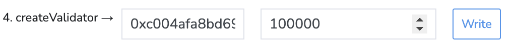

# Become a Validator

Validator nodes are a crucial component of the X1 network.
These nodes operate as full nodes and contribute to consensus,
thereby enhancing the network's security and facilitating the creation of new blocks.

::: info Requirements

- Minimum stake requirement: 100,000 XN
- Maximum stake: 15x the minimum state amount
- Earn staking rewards and a 15% fee on delegator's rewards
- Minimum hardware requirements: AWS T2.large EC2 (or equivalent) and at least
  800GB of Amazon EBS General Purpose SSD (gp2) storage (or equivalent).
:::

## Step 1: Run A Full Node

Following the [Developer Docs](./getting-started) guide to install and run a full node. 

::: tip 
Allow the node to **fully sync** before proceeding to the next steps.
:::

## Step 2: Fund a wallet

Deposit enough XN into your wallet to meet the validator requirements. 

As of the current writing, a minimum of 100,000 XN (plus gas fees) is required.

::: warning
For enhanced security, the use of a hardware wallet is strongly recommended.
:::

## Step 3: Create a Validator Key

Generate a validator key using x1. Remember to note down the validator public key, as it will be needed later. 
Set a strong password when prompted.

::: tabs key:os

== Linux Service

```shell [Linux Service]
# Switch to the x1 user first.
# This is optional depending on your setup.
sudo su x1

x1 validator new
```

== MacOS Service

```shell [MacOS Service]
x1 validator new
```

== With Command Flags

```shell [With Command Flags]
x1 validator new
```
:::

## Step 4: Save the Validator Password

> Securely store your validator password in a file using the given command:
```shell
echo "MY_STRONG_PASSWORD" > ~/.x1/.password
```

## Step 5: Navigate to the X1 Explorer

Access the [SFC Contract](https://explorer.x1-testnet.xen.network/address/0xFC00FACE00000000000000000000000000000000/write-contract#address-tabs) through the X1 Explorer.

## Step 6: Connect Your Wallet

Use the “Connect wallet” button to link your validator wallet.

[](connect-wallet.png)

## Step 7: Enter Your Validator Public Key

Input your validator public key and desired stake amount, then click “Write.”

[](create-validator.png)

## Step 8: Confirm the Transaction

Approve the transaction through your wallet.

## Step 9: Verify Your Validator Registration

Confirm your validator status by finding your validator ID on the [PWA explorer](https://pwa-explorer.x1-testnet.xen.network/staking) using your wallet account, and note down the ID.

## Step 10: Update the X1 Configuration File

Update the configuration file with your Validator ID, public key, and password file location.

::: tabs key:os
== Linux Service

```shell [Linux Service]
# Use the example config file for a validator node
cp /usr/local/share/x1/configs/testnet/validator-node.toml \
  /etc/x1/config.toml

# Edit the config file and update the Validator ID,
# public key, and password file's path.
# (Use your favorite text editor)
nano /etc/x1/config.toml

# Restart the node
sudo systemctl restart x1.service

# check the logs for any errors
journalctl -t x1 -f
```

== MacOS Service

```shell [MacOS Service]
# Use the example config file for a validator node
cp $HOMEBREW_PREFIX/share/x1/configs/testnet/validator-node.toml \
  $HOMEBREW_PREFIX/etc/x1/config.toml

# Edit the config file (use your favorite text editor) and update the Validator ID,
# public key, and password file's path (use the full path: ex: /Users/cool_person/.x1/.password).
nano $HOMEBREW_PREFIX/etc/x1/config.toml

# Restart the node
brew services restart x1

# check the logs for any errors
tail -f /opt/homebrew/var/log/x1.log
```

== With Command Flags

```shell [With Command Flags]
# Example command line flags for a validator node.
# Replace `YOUR_VALIDATOR_ID` with your validator ID and
# `YOUR_VALIDATOR_PUBKEY` with your validator's public key.
x1 --testnet \
   --syncmode snap \
   --validator.id YOUR_VALIDATOR_ID \
   --validator.pubkey YOUR_VALIDATOR_PUBKEY \
   --validator.password ~/.x1/.password
```

:::

::: tip 🎉 Awesome!
You're now running an X1 validator node! Make sure to keep your node up and running.
:::
